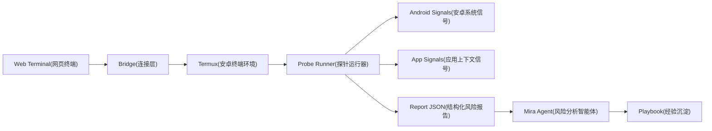
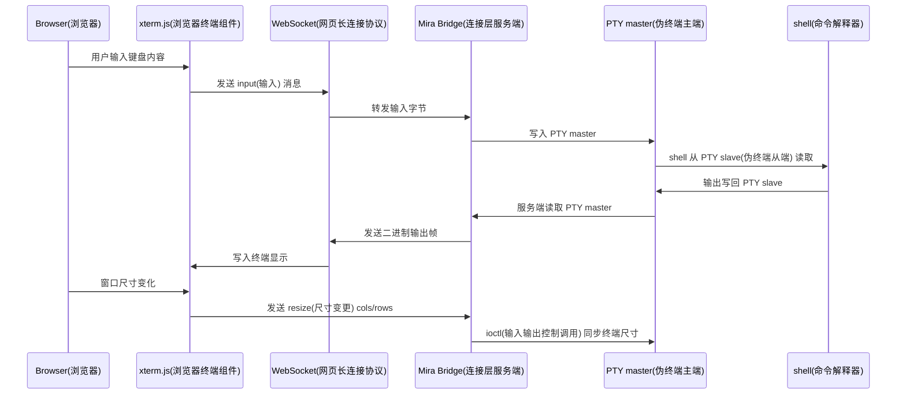

# Mira

> 面向移动风控场景的环境风险智能体。

Mira 把移动安全开发经验沉淀为可执行的 Probe(检测探针), Playbook(执行手册) 和 Report(风险报告), 让 Agent(智能体) 在受控 Android(安卓系统) 环境中完成采样, 关联, 解释和复查。

它不是一个单纯跑命令的工具, 而是一套把风险环境排查经验转成自动化判断链的框架。

## 为什么做

移动风控里的环境风险很少由单个特征决定。

模拟器, 改机, Root(提权环境), Hook(运行时劫持), Magisk(隐藏提权框架), Xposed(运行时注入框架) 和系统属性伪装往往会交叉出现。真正有价值的不是某条命令的输出, 而是多条信号之间的关系, 权重, 误报来源和下一步验证路径。

Mira 的目标是把这些经验沉淀成可执行资产:

1. 采集设备和应用运行环境里的风险信号。
2. 将零散信号归一化为结构化证据。
3. 让 Agent 根据 Playbook 进行关联分析。
4. 输出可复查的风险结论, 置信度和下一步验证建议。
5. 把每次排查中有价值的判断沉淀回经验库。

## 核心思路



Mira 将检测流程拆成四层:

1. Bridge(连接层): 负责 Web Terminal 和 Termux 之间的长连接, 命令分发和输出回传。
2. Probe(检测探针): 负责采集模拟器, 改机, 注入, 系统属性和应用上下文信号。
3. Analyzer(分析器): 负责把 Probe 输出转成风险评分, 证据链和复查建议。
4. Playbook(执行手册): 负责沉淀经验, 包括信号含义, 误报来源, 组合判断和验证路径。

## 首周目标

一周内先做出 MVP(最小可行产品):

> 在 Termux 中运行 Mira, 通过 Web Terminal 触发环境检测, 自动生成一份模拟器和改机风险报告。

### Day 1: 项目骨架

1. 初始化仓库结构。
2. 定义风险报告 JSON Schema(结构化数据约束)。
3. 定义 Probe 输出格式。
4. 写出第一版 Playbook 文档结构。

### Day 2: Termux 执行桥

1. 实现本地命令执行器。
2. 实现 WebSocket(网页长连接协议) 输出流。
3. 支持命令超时, 输出截断和错误码记录。
4. 预留命令白名单能力。

### Day 3: 模拟器风险探针

1. 采集系统属性。
2. 采集硬件和设备标识。
3. 采集传感器和文件路径特征。
4. 输出 emulator category(模拟器类别) 的结构化信号。

### Day 4: 改机风险探针

1. 采集 su(提权命令) 和常见 Root 路径。
2. 采集 Magisk 和 KernelSU(内核级提权框架) 痕迹。
3. 采集 Xposed, LSPosed(运行时注入框架) 和常见注入特征。
4. 输出 tamper category(改机类别) 的结构化信号。

### Day 5: Agent 分析链

1. 将 Probe 输出聚合为统一 Report。
2. 根据 Playbook 解释信号意义。
3. 输出风险等级, 置信度, 证据链和误报说明。
4. 给出下一轮验证命令或验证方向。

### Day 6: Web Terminal 原型

1. 浏览器侧展示实时命令输出。
2. 支持一键运行检测任务。
3. 支持下载或复制报告。
4. 保留一次完整检测会话记录。

### Day 7: 打磨和验收

1. 跑通一台真实设备和一个模拟器环境。
2. 对比两类环境的输出差异。
3. 补齐 README 和首批 Playbook。
4. 固化第一版验收用例。

## 风险报告格式

Mira 的报告优先机器可读, 再由 Agent 转成人可读解释。

```json
{
  "target": {
    "platform": "android",
    "runtime": "termux",
    "session_id": "local-session"
  },
  "summary": {
    "risk_level": "high",
    "confidence": "medium",
    "score": 78
  },
  "findings": [
    {
      "category": "emulator",
      "signal": "qemu_property",
      "risk": "high",
      "evidence": "ro.kernel.qemu=1",
      "reason": "该属性常见于模拟器环境",
      "false_positive": "部分云真机或定制系统可能出现相似属性"
    }
  ],
  "next_steps": [
    "继续检查硬件标识和传感器数量",
    "对比真实设备基线"
  ]
}
```

## 初始目录规划

```text
mira/
  agent/
    prompts/
    analyzers/
  bridge/
    termux/
    websocket/
  probes/
    emulator/
    tamper/
    hook/
    system/
  playbooks/
    emulator.md
    tamper.md
    hook.md
  schemas/
    finding.schema.json
    report.schema.json
  reports/
  docs/
```

## 第一版验收标准

1. 可以在 Termux 中启动 Mira。
2. 可以从浏览器打开 Web Terminal 并看到实时输出。
3. 可以一键运行模拟器和改机风险检测。
4. 每个 Probe 都输出统一 JSON(结构化数据格式)。
5. Agent 可以基于报告生成风险结论, 证据链和复查建议。
6. 至少完成 2 个 Playbook: 模拟器检测和改机检测。
7. 至少保留 2 份样例报告: 真实设备和模拟器环境。

## 技术边界

Mira 默认运行在 Termux 环境中, 看到的是 Termux 权限和系统可见范围。

如果需要分析 App(应用程序) 内部运行态, 需要额外接入:

1. SDK(软件开发工具包) 采集应用内信号。
2. Debug Bridge(调试桥) 连接测试包。
3. Frida(动态插桩工具) 等授权测试链路。
4. 服务端会话记录和策略配置。

因此第一版优先做外部环境风险检测, 不把 App 内部检测和线上风控策略混在一起。

## 后续方向

1. 建立真实设备基线库。
2. 建立模拟器和云手机特征库。
3. 增加 Hook 和注入风险检测。
4. 增加报告对比能力。
5. 增加 Playbook 自动沉淀能力。
6. 增加服务端任务编排和历史检索。

## Android APK MVP

Mira 当前主线已经切到 Android APK(安卓安装包) 形态, 目标是在 Mira 自己的第三方应用沙盒里持有真实 PTY(伪终端), 再通过 Web Terminal(网页终端) 操作 shell(命令解释器)。

当前闭环复用 Termux app(安卓终端应用) 的 `terminal-emulator` 模块作为 submodule(代码子模块), 并通过 JNI(本地接口) 创建 PTY 子进程。Mira 还会创建最小 bootstrap(启动用户空间), 让 shell 从 `/data/user/0/com.vwww.mira/files/usr/bin/sh` 进入。

### 构建 APK

```bash
./gradlew :mira-app:assembleDebug
```

产物位置:

```text
android/app/build/outputs/apk/debug/mira-app-debug.apk
```

### 安装并启动

```bash
adb install -r android/app/build/outputs/apk/debug/mira-app-debug.apk
adb shell am start -n com.vwww.mira/.MainActivity
```

Mira APK 首页只暴露远程 Relay(中继) 连接入口。Local Terminal(本地终端) 调试入口不再展示在手机首页。

当前手机侧只需要填写 Relay URL(中继地址), 点击 Connect Relay(连接中继), 然后由浏览器在 Relay 页面按需打开真实 PTY。远程运行方式见下方 `Remote On-Demand Terminal 运行说明`。

当前 shell 路径和工作目录是:

```text
/data/user/0/com.vwww.mira/files/usr/bin/sh
/data/user/0/com.vwww.mira/files/home
```

### Termux fork 备用路线

仓库保留 Termux fork(分叉)作为备用研究路线, 但当前主线已经改为 APK(安卓安装包) 直接打包 BusyBox(单文件工具集), 不接 Termux package repository(包仓库), 不维护 apt(包管理器) 软件源索引。

备用路线包含:

1. `third_party/termux-app`: 复用 Termux APK 和终端能力源码。
2. `third_party/termux-packages`: 用新 package(包名) 重编 bootstrap。
3. `tools/termux/prepare-mira-termux-packages.sh`: 生成 Mira bootstrap 构建工作区。
4. `tools/termux/prepare-mira-termux-app.sh`: 生成改名后的 Termux app 工作区。

完整说明见 `docs/TERMUX-FORK.md`。

## Remote On-Demand Terminal 运行说明

Mira 现在的远程主路径是 Android 主动连接 Relay Server(中继服务端), 浏览器再按需打开 Android PTY。它不再要求 Scan LAN(局域网扫描), 也不做二维码扫码。

本阶段远程 Relay 不使用 Pairing Token(配对令牌)。企业自托管场景默认由自己的服务端边界控制访问, 协议里只使用 installId(安装标识) 识别设备和 sessionId(会话标识) 绑定会话。

远程 session 会自动释放内置 BusyBox(单文件工具集) 到临时工具目录, 并把该目录放到 PATH(命令搜索路径) 前面。当前已打包 arm64-v8a, armeabi-v7a, x86 和 x86_64 四个 ABI(应用二进制接口), 每个二进制约 784 KiB 到 835 KiB, 会话关闭后删除释放副本。

### 一键公网启动

```bash
./tools/relay/start-public-relay.sh
```

脚本会启动 Cloudflare Quick Tunnel(随机公网隧道), 再启动 Mira Relay, 并打印:

```text
Browser URL: https://*.trycloudflare.com
Android Relay URL: https://*.trycloudflare.com
```

电脑浏览器打开 Browser URL。手机打开 Mira APK, 填写 Android Relay URL, 点击 `Connect Relay`。

该脚本会自动构建 `apps/console`。如果要跳过前端构建, 可以设置:

```bash
MIRA_SKIP_CONSOLE_BUILD=1 ./tools/relay/start-public-relay.sh
```

Relay 只加载 `apps/console` 的 Next.js(前端应用框架) 构建产物, 展示设备大厅和三栏式设备工作台。不再保留旧版内联 Web Terminal(网页终端) 页面。如果没有构建产物, 首页会提示先构建控制台。

构建新版浏览器控制台:

```bash
cd apps/console
npm install
npm run build
cd ../..
```

随后重新启动 Relay 即可看到新版 UI(用户界面)。

### 局域网启动

```bash
python3 -m mira.relay.server \
  --host 0.0.0.0 \
  --port 8765 \
  --advertise-url http://<电脑局域网IP>:8765
```

浏览器和手机都使用同一个地址:

```text
http://<电脑局域网IP>:8765
```

### Android 端

1. 打开 Mira APK 首页。
2. 填写 Relay URL(中继地址)。
3. 点击 `Connect Relay`。
4. 回到浏览器等待设备列表出现。
5. 点击 `Open Terminal`。

服务端通过 control WebSocket(控制长连接) 向设备发送 session.open(打开会话) 请求, 设备收到后才创建 PTY 并主动连接服务端。详细说明见 `docs/REMOTE-RELAY.md`。

内置工具箱说明见 `docs/TOOLBOX.md`。

## MCP 接入说明

Mira 现在提供 MCP(Model Context Protocol, 模型上下文协议) server(服务端), 让外部 Codex 这类 AI client(智能客户端) 可以通过标准 tools(工具), resources(资源) 和 prompts(提示模板) 操作 Relay Terminal(中继终端)。

启动 Relay Server 后, MCP client 以 stdio(标准输入输出) 方式启动:

```bash
python3 -m mira.mcp.server \
  --relay http://127.0.0.1:8765
```

Codex CLI(命令行接口) 非交互执行时建议给每个 Mira MCP tool(工具) 显式配置 `approval_mode = "approve"`, 避免工具调用在本地审批层被取消。完整配置示例见 `docs/MCP.md`。

如果要让 Codex 自主做 Magisk(安卓 root 管理框架) 手机风险发现, 使用 `mira_magisk_risk_review` prompt(提示模板)。该 prompt 只提供环境上下文: 目标是 Magisk 手机, 当前 shell 位于第三方 app 权限内, 真实 PTY 可操作, 会话里可以使用 BusyBox(单文件工具集)。

核心工具包括:

1. `mira_list_devices`: 读取已连接 Relay 的设备。
2. `mira_open_terminal`: 打开远程 PTY(伪终端) session(会话)。
3. `mira_run_command`: 在同一个 PTY 中执行命令并读取输出。
4. `mira_collect_snapshot`: 采集第一轮 Android(安卓系统) 分析快照。
5. `mira_close_terminal`: 关闭会话并清理设备侧临时状态。

完整说明见 `docs/MCP.md`。

## Web Terminal MVP 运行说明

本轮 MVP(最小可行产品) 只实现 Web Terminal(网页终端) 到 PTY(伪终端) 的实时连接, 不实现 Probe(检测探针), Report(风险报告), Agent(智能体) 分析或多设备管理。

### 启动服务端

```bash
python3 -m mira.bridge.server --host 127.0.0.1 --port 8765
```

启动后打开:

```text
http://127.0.0.1:8765/
```

浏览器页面会通过 WebSocket(网页长连接协议) 连接 `/ws/terminal`, 服务端创建一个真实 shell(命令解释器) 并挂到 PTY 上。前端 xterm.js(浏览器终端组件) 已随仓库放在 `web/vendor/xterm/`, 不依赖外部 CDN(内容分发网络)。

### 验收命令

在网页终端中输入:

```bash
pwd
ls
echo hello
```

预期结果:

1. 命令输出实时显示在浏览器里。
2. 多条命令运行在同一个持久 PTY session(终端会话) 中, 不是一次性 exec(命令执行) stdout(标准输出)。
3. 调整浏览器窗口后, 前端会把 cols/rows(列数/行数) 同步给服务端 PTY。

### 数据流



### 后续能力记录

后续方向只记录在 `docs/TODO.md`, 本轮不实现 Live UI(实时界面) 上传, 设备指标, logcat(Android 系统日志), 自动化任务, Probe 报告, Agent 分析和多设备管理。

## 项目状态

Mira 现在处于首周 MVP 阶段。

当前优先级是跑通闭环, 而不是堆检测项。第一周只追求一件事: 让移动安全经验第一次以 Agent 化流程跑起来。
