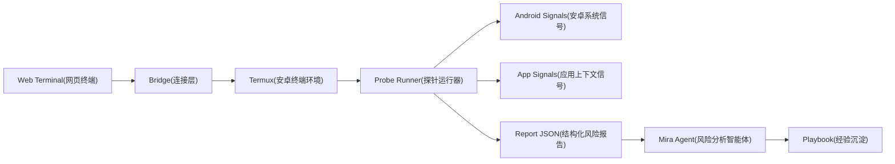

# Mira

> 面向移动风控场景的环境风险智能体。

Mira 把移动安全开发经验沉淀为可执行的 Probe(检测探针), Playbook(执行手册) 和 Report(风险报告), 让 Agent(智能体) 在受控 Android(安卓系统) 环境中完成采样, 关联, 解释和复查。

它不是一个单纯跑命令的工具, 而是一套把风险环境排查经验转成自动化判断链的框架。

## 为什么做

移动风控里的环境风险很少由单个特征决定。

模拟器, 改机, Root(提权环境), Hook(运行时劫持), Magisk(隐藏提权框架), Xposed(运行时注入框架) 和系统属性伪装往往会交叉出现。真正有价值的不是某条命令的输出, 而是多条信号之间的关系, 权重, 误报来源和下一步验证路径。

Mira 的目标是把这些经验沉淀成可执行资产:

1. 采集设备和应用运行环境里的风险信号。
2. 将零散信号归一化为结构化证据。
3. 让 Agent 根据 Playbook 进行关联分析。
4. 输出可复查的风险结论, 置信度和下一步验证建议。
5. 把每次排查中有价值的判断沉淀回经验库。

## 核心思路



Mira 将检测流程拆成四层:

1. Bridge(连接层): 负责 Web Terminal 和 Termux 之间的长连接, 命令分发和输出回传。
2. Probe(检测探针): 负责采集模拟器, 改机, 注入, 系统属性和应用上下文信号。
3. Analyzer(分析器): 负责把 Probe 输出转成风险评分, 证据链和复查建议。
4. Playbook(执行手册): 负责沉淀经验, 包括信号含义, 误报来源, 组合判断和验证路径。

## 首周目标

一周内先做出 MVP(最小可行产品):

> 在 Termux 中运行 Mira, 通过 Web Terminal 触发环境检测, 自动生成一份模拟器和改机风险报告。

### Day 1: 项目骨架

1. 初始化仓库结构。
2. 定义风险报告 JSON Schema(结构化数据约束)。
3. 定义 Probe 输出格式。
4. 写出第一版 Playbook 文档结构。

### Day 2: Termux 执行桥

1. 实现本地命令执行器。
2. 实现 WebSocket(网页长连接协议) 输出流。
3. 支持命令超时, 输出截断和错误码记录。
4. 预留命令白名单能力。

### Day 3: 模拟器风险探针

1. 采集系统属性。
2. 采集硬件和设备标识。
3. 采集传感器和文件路径特征。
4. 输出 emulator category(模拟器类别) 的结构化信号。

### Day 4: 改机风险探针

1. 采集 su(提权命令) 和常见 Root 路径。
2. 采集 Magisk 和 KernelSU(内核级提权框架) 痕迹。
3. 采集 Xposed, LSPosed(运行时注入框架) 和常见注入特征。
4. 输出 tamper category(改机类别) 的结构化信号。

### Day 5: Agent 分析链

1. 将 Probe 输出聚合为统一 Report。
2. 根据 Playbook 解释信号意义。
3. 输出风险等级, 置信度, 证据链和误报说明。
4. 给出下一轮验证命令或验证方向。

### Day 6: Web Terminal 原型

1. 浏览器侧展示实时命令输出。
2. 支持一键运行检测任务。
3. 支持下载或复制报告。
4. 保留一次完整检测会话记录。

### Day 7: 打磨和验收

1. 跑通一台真实设备和一个模拟器环境。
2. 对比两类环境的输出差异。
3. 补齐 README 和首批 Playbook。
4. 固化第一版验收用例。

## 风险报告格式

Mira 的报告优先机器可读, 再由 Agent 转成人可读解释。

```json
{
  "target": {
    "platform": "android",
    "runtime": "termux",
    "session_id": "local-session"
  },
  "summary": {
    "risk_level": "high",
    "confidence": "medium",
    "score": 78
  },
  "findings": [
    {
      "category": "emulator",
      "signal": "qemu_property",
      "risk": "high",
      "evidence": "ro.kernel.qemu=1",
      "reason": "该属性常见于模拟器环境",
      "false_positive": "部分云真机或定制系统可能出现相似属性"
    }
  ],
  "next_steps": [
    "继续检查硬件标识和传感器数量",
    "对比真实设备基线"
  ]
}
```

## 初始目录规划

```text
mira/
  agent/
    prompts/
    analyzers/
  bridge/
    termux/
    websocket/
  probes/
    emulator/
    tamper/
    hook/
    system/
  playbooks/
    emulator.md
    tamper.md
    hook.md
  schemas/
    finding.schema.json
    report.schema.json
  reports/
  docs/
```

## 第一版验收标准

1. 可以在 Termux 中启动 Mira。
2. 可以从浏览器打开 Web Terminal 并看到实时输出。
3. 可以一键运行模拟器和改机风险检测。
4. 每个 Probe 都输出统一 JSON(结构化数据格式)。
5. Agent 可以基于报告生成风险结论, 证据链和复查建议。
6. 至少完成 2 个 Playbook: 模拟器检测和改机检测。
7. 至少保留 2 份样例报告: 真实设备和模拟器环境。

## 技术边界

Mira 默认运行在 Termux 环境中, 看到的是 Termux 权限和系统可见范围。

如果需要分析 App(应用程序) 内部运行态, 需要额外接入:

1. SDK(软件开发工具包) 采集应用内信号。
2. Debug Bridge(调试桥) 连接测试包。
3. Frida(动态插桩工具) 等授权测试链路。
4. 服务端会话记录和策略配置。

因此第一版优先做外部环境风险检测, 不把 App 内部检测和线上风控策略混在一起。

## 后续方向

1. 建立真实设备基线库。
2. 建立模拟器和云手机特征库。
3. 增加 Hook 和注入风险检测。
4. 增加报告对比能力。
5. 增加 Playbook 自动沉淀能力。
6. 增加服务端任务编排和历史检索。

## 项目状态

Mira 现在处于首周 MVP 阶段。

当前优先级是跑通闭环, 而不是堆检测项。第一周只追求一件事: 让移动安全经验第一次以 Agent 化流程跑起来。
