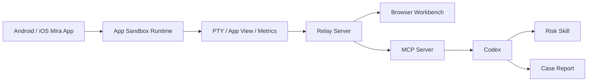

# Mira

> 移动安全开发在 AI 时代的提效探索。

Mira 是一个面向移动安全工程师的研究工具, 用来探索 AI(人工智能) 如何进入 Android(安卓系统) 和 iOS(苹果移动系统) App(应用) 沙盒视角, 观察运行时风险信号, 调用可复用的 Skill(技能), 并把每一次排查沉淀成可复查的 Case(案例)。

它不是 SDK(软件开发工具包), 不是远控框架, 也不是黑盒检测器。Mira 关注的是一条更长期的链路: 如何把移动安全开发里的排查经验, 证据链判断和复盘方法, 转成 AI 可以反复调用和持续改进的知识资产。

Mira 当前已经跑通 Android / iOS 双端 App 沙盒会话, Relay(中继服务), 浏览器工作台, PTY(伪终端), MCP(Model Context Protocol, 模型上下文协议), 风险 Skill 和本地 Case 的主闭环。接下来我会基于这个框架持续分析常见模拟器, 云手机, 改机, Root(提权环境), Hook(运行时劫持), 注入和自动化框架的运行时特征, 并把每次分析整理成文章, Skill 和 Case, 作为自己的移动安全学习记录。

[MCP 接入](docs/MCP.md) | [Relay 说明](docs/REMOTE-RELAY.md) | [iOS 说明](docs/IOS-APP.md) | [原生 PTY 架构](docs/NATIVE-ARCHITECTURE.md) | [风险 Skill](skills/mira-mobile-risk-review/SKILL.md)

## 演示预告

<!--
录制完成后把 GIF 放到 docs/assets/mira-ai-emulator-review.gif, 再取消下面这段注释。

<p align="center">
  
</p>
-->

第一段演示会尽量保持简单: 手动连接 Mira App, 在浏览器工作台打开 App 沙盒终端和实时画面, 然后让 Codex 读取 `skills/mira-mobile-risk-review`, 分析一个模拟器环境, 最后输出结构化风险发现。

```text
打开 Mira App -> 主动连接 Relay -> 打开沙盒会话 -> 让 AI 分析模拟器环境 -> 沉淀 Case
```

这段演示想证明的不是“跑了几条命令”, 而是 AI 能不能顺着移动 App 沙盒里能看到的线索, 把异常信号解释成一条可复查的证据链。

## 核心能力

### AI 驱动运行时风险发现

Mira 让 AI 进入已经主动连接的 App 沙盒会话, 从当前进程, 沙盒文件视图, PTY 输出, 运行态指标和 App 自身画面中观察可疑信号。

真正有价值的不是某个单点检测结果, 而是 AI 能不能解释:

1. 哪些现象看起来异常。
2. 这些现象来自哪个可见边界。
3. 为什么它们可能和模拟器, 云手机, 改机, Root, Hook 或注入有关。
4. 哪些地方可能误报。
5. 下一步应该用什么路径交叉验证。

### Android / iOS 双端沙盒工作台

Mira 在 Android 和 iOS 上提供一致的浏览器工作台体验: 设备列表, App 实时画面, 沙盒 PTY, 运行态指标, 会话控制和 MCP 工具调用。

这不是系统级远控桌面。Android 侧进入的是 Mira 自身 App 沙盒和 `/proc/self/*` 当前进程视角。iOS 侧提供 `/mira` App 视图根目录和 `/mira/proc` 模拟进程视图, 用来帮助 AI 理解当前 App 运行态, 而不是假装拥有整台设备。

### 从异常信号到证据链

移动风险环境很少由单个特征决定。模拟器痕迹, 云手机特征, Root 文件, Hook 框架, 注入库, 可疑挂载, 文件描述符异常和系统属性伪装经常交叉出现。

Mira 不追求把这些现象压成一个黑盒分数。它更关心把一次排查摊开:

1. 看到了什么。
2. 来自哪里。
3. 为什么可疑。
4. 有什么正常解释。
5. 还需要看什么。
6. 是否值得沉淀为 Skill 规则或 Case 样例。

### 持续沉淀的 Skill 和 Case

Mira 不只是一个能打开 shell(命令解释器) 的 demo(演示)。它更像一个持续更新的移动安全运行时观察笔记本。

后续每分析一个常见环境或框架, 我都会尽量沉淀三类资产:

1. 文章: 解释一次分析过程, 信号来源, 判断路径和踩坑点。
2. Skill: 把可复用的观察方法整理成 AI 可以调用的检查流程。
3. Case: 保留一次具体环境里的证据链, 不确定性和后续验证方向。

长期目标不是维护一套神奇检测代码, 而是沉淀一套可以复查, 可以迁移, 可以被 AI 反复调用的移动安全分析方法。

## 研究计划

Mira 也是我在 AI 时代重新学习移动安全开发的公开记录。

后续计划围绕这些方向持续更新文章, Skill 和 Case:

1. 模拟器环境运行时特征分析。
2. 云手机和远程设备环境特征分析。
3. Root, Magisk(模块化 Root 框架) 和改机痕迹分析。
4. Hook, Frida(动态插桩工具), Xposed(运行时注入框架) 和注入痕迹分析。
5. Android `/proc/self/maps`, `/proc/self/status`, `/proc/self/mountinfo` 观察方法。
6. iOS `/mira` 和 `/mira/proc` 沙盒视角建模。
7. 如何把一次排查沉淀成 AI 可复用的 Skill 和 Case。

如果你也关注 AI 如何提升移动安全开发效率, 可以 star(收藏) 或 watch(关注) 这个项目。后面我会把更多具体环境的分析过程持续补进来。

## 授权研究边界

Mira 只面向授权研究和自有 App 分析。

1. 只观察和交互 Mira 宿主 App 自身沙盒。
2. 不控制其他 App。
3. 不提供系统级远控能力。
4. 不提供 root, jailbreak(越狱) 绕过或系统沙盒绕过能力。
5. 不提供生产 SDK 或静默后台控制能力。
6. 所有会话都必须从 Mira App 内主动连接 Relay 后才存在。

## 工作原理



Mira 的主线由四层组成:

1. Mobile App(移动端应用): Android 和 iOS 都提供受系统沙盒限制的端侧运行环境。
2. Relay: 移动端主动连接自托管 Relay, 浏览器按需打开终端, 画面和指标。
3. MCP: AI client(客户端) 通过标准工具读取设备运行时状态, 打开 PTY, 执行授权分析步骤。
4. Skill + Case: Agent(智能体) 读取风险观察方法, 把可疑行为整理成本地 Case。

## 平台视角和边界

1. Android 侧进入的是 Mira 第三方 App sandbox 内的真实 PTY, 不是 adb shell, 不是 root shell。
2. Android 风险观察优先看当前进程和 shell 可见范围, 例如 `/proc/self/maps`, `/proc/self/status`, `/proc/self/mountinfo`, `/proc/self/fd` 和系统公开接口。
3. iOS 侧 `/mira` 是 Mira 提供的 app-view root(应用视图根目录), 表达 App 沙盒内可见文件视图, 不是系统真实 `/`。
4. iOS 侧 `/mira/proc` 是 Mira 利用 iOS 系统接口模拟的 process view(进程视图), 用来让 AI 理解当前 App 进程状态, 不是 iOS 内核原生 procfs。
5. App 画面只来自 Mira App 自己的 key window(主窗口), 不采集系统全屏, 不采集其他 App 画面, 不采集输入法画面。
6. Mira 默认不提供黑盒检测代码。可疑行为有就是有, 先说出来, 再标注来源, 边界, 解释和下一步观察方向。

## 快速开始

### 1. 启动 Relay 和浏览器工作台

局域网演示优先使用:

```bash
./mira-local-web
```

电脑浏览器打开:

```text
http://localhost:8765
```

Android 或 iOS 端填写:

```text
http://<电脑局域网 IP>:8765
```

如果需要公网临时演示, 可以使用:

```bash
./mira-web
```

`./mira-web` 会启动 Mira Relay, 构建 `apps/console`, 并通过 cpolar 输出可访问的 Browser URL(浏览器地址) 和移动端 Relay URL(中继地址)。详细说明见 `docs/REMOTE-RELAY.md`。

### 2. 构建并启动 Android App

```bash
./gradlew :mira-app:assembleDebug
adb install -r android/app/build/outputs/apk/debug/mira-app-debug.apk
adb shell am start -n com.vwww.mira/.MainActivity
```

Android shell 的默认路径和工作目录是:

```text
/data/user/0/com.vwww.mira/files/usr/bin/sh
/data/user/0/com.vwww.mira/files/home
```

原生 PTY 层已经整理为 Android 和 iOS 可共享的 POSIX(可移植操作系统接口) 架构, 详细边界见 `docs/NATIVE-ARCHITECTURE.md`。

### 3. 构建并启动 iOS App

命令行构建并启动 iOS Simulator(模拟器):

```bash
./mira-ios
```

也可以直接用 Xcode 打开:

```bash
open ios/Mira/Mira.xcodeproj
```

iOS 侧已经接入 Relay, PTY, Mira App 自身 key window 画面上传, 设备指标采样, `/mira` app-view root 和 `/mira/proc` simulated process view(模拟进程视图)。详细说明见 `docs/IOS-APP.md`。

### 4. 连接移动端

1. 打开 Android 或 iOS 端 Mira App 首页。
2. 填写 Relay URL。
3. 点击 `Connect Relay`。
4. 回到浏览器等待设备列表出现。
5. 点击 `Open Terminal` 打开 App 沙盒会话。

服务端通过 control WebSocket(控制通道) 向设备发送 `session.open` 请求, 设备收到后才创建 PTY 并主动连接服务端。

## MCP 接入

启动 Relay Server 后, MCP client 以 stdio(标准输入输出) 方式启动:

```bash
python3 -m mira.mcp.server \
  --relay http://127.0.0.1:8765
```

核心工具包括:

1. `mira_list_devices`: 读取已连接 Relay 的设备。
2. `mira_open_terminal`: 打开远程 PTY session(会话)。
3. `mira_run_command`: 在同一个 PTY 中执行命令并读取输出。
4. `mira_collect_snapshot`: 采集第一轮 Android 分析快照。
5. `mira_close_terminal`: 关闭会话并清理设备侧临时状态。

如果要让 Codex 做移动风险分析, 可以让它读取 `skills/mira-mobile-risk-review`, 再针对当前授权会话生成观察步骤和 Case。完整配置见 `docs/MCP.md`。

## CLI

```bash
./mira-cli devices
./mira-cli run 'pwd'
./mira-cli shell
```

`mira-cli` 直接使用 Relay HTTP 和 WebSocket, 不经过 MCP。默认连接 `http://127.0.0.1:8765`, 也可以指定 Relay:

```bash
./mira-cli --relay https://example.invalid devices
./mira-cli run 'echo hello' --relay https://example.invalid
```

`shell` 会进入交互式远程 PTY, 按 `Ctrl-]` 退出本地 CLI 会话并关闭远程 session。

## 使用须知

使用 Mira 即表示你确认:

1. 只在自己拥有或已获得明确授权的 App, 设备和运行环境中使用 Mira。
2. 不使用 Mira 控制其他 App, 绕过平台保护, 访问未授权数据, 或执行系统级远程控制。
3. Mira 不提供生产 SDK, 静默后台控制, root, jailbreak 绕过, 或跨 App 自动化能力。
4. 所有会话都必须从 Mira App 内主动发起, 且仅限 Mira 自身 App 沙盒和普通第三方 App 权限范围。
5. 使用者需自行遵守适用法律, 平台规则和内部安全规范。

## 文档

更多细节下沉到文档中:

1. `docs/REMOTE-RELAY.md`: Relay 和远程按需终端说明。
2. `docs/MCP.md`: MCP server 配置和工具说明。
3. `docs/IOS-APP.md`: iOS App 架构和运行说明。
4. `docs/NATIVE-ARCHITECTURE.md`: Android 和 iOS 共享原生 PTY 架构。
5. `docs/TOOLBOX.md`: Android 内置工具箱说明。
6. `docs/TERMUX-FORK.md`: Termux fork 备用研究路线。
7. `docs/REPO-ARCHITECTURE.md`: 仓库分层说明。

## 当前状态

Mira 当前处于 v1.0.0 演示和文章准备阶段。移动端沙盒会话, Relay, 浏览器工作台, MCP, Skill 和 Case 的主闭环已经跑通。

接下来会先补一段 GIF(动图), 展示 AI 如何在模拟器环境里从 App 沙盒视角拉出风险证据链。后续每做一个常见环境或框架的分析, 都会尽量同步沉淀文章, Skill 和 Case。
