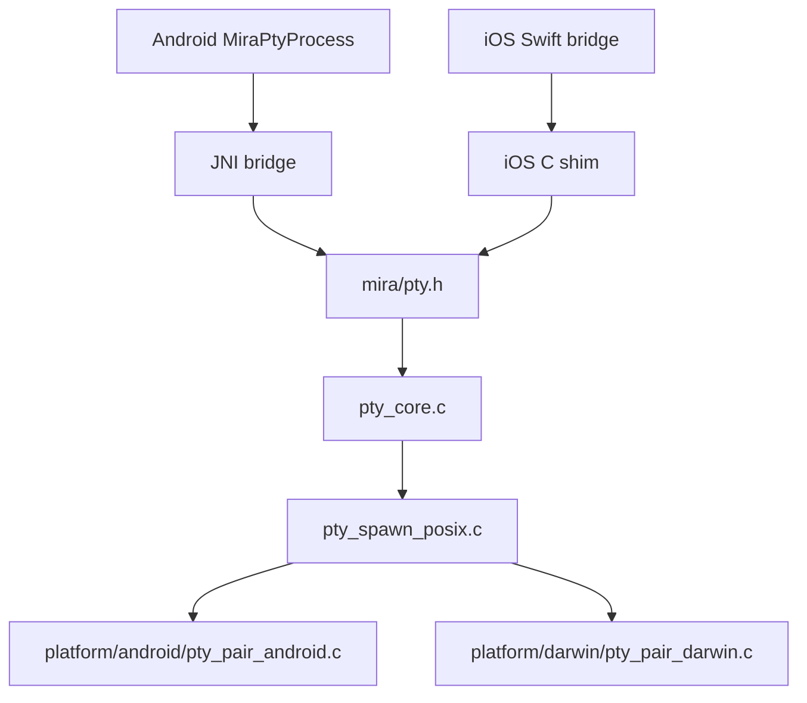

# Native Architecture(原生架构)

本文记录 Mira 原生层架构。当前目标是让 Android(安卓系统) 和 iOS(苹果移动系统) 共享 PTY(伪终端) 的核心进程生命周期能力, 尤其是 fork(派生进程) 和 exec(替换进程镜像) 这条底层链路, 避免后续出现两套难维护的实现。

## 架构原则

1. `native/include` 只放稳定 C API(C 语言接口), 上层平台只能依赖这里。
2. `native/src/pty` 放 PTY 生命周期核心, 不关心 JNI(Java 本地接口), Swift(苹果平台开发语言), Android 或 iOS UI(用户界面)。
3. `native/src/posix` 放 POSIX(可移植操作系统接口) 公共实现, 包括 fork, setsid(创建新会话), dup2(复制文件描述符), chdir(切换工作目录), execvp(按 PATH 查找并执行程序), read/write(读写字节流), resize(调整终端尺寸), waitpid(等待子进程) 和 signal(信号) 管理。
4. `native/src/platform/*` 只放平台差异, 例如怎么创建 PTY 主从端, 怎么清理 fd(文件描述符)。
5. `native/bridge/*` 只放语言桥接, Android 走 JNI, iOS 平台走 C shim(薄适配层) 给 Swift 调用。
6. 平台 App(应用程序) 只持有 `MiraPtySession` 这类会话抽象, 不直接拼接 C 层内部细节。

## 当前目录

```text
native/
  include/
    mira/
      pty.h

  src/
    pty/
      pty_core.c
      pty_platform.h

    posix/
      pty_spawn_posix.c
      pty_posix_platform.h

    platform/
      android/
        pty_pair_android.c

      darwin/
        pty_pair_darwin.c

  bridge/
    android/
      jni/
        mira_pty_jni.c

    ios/
      mira_pty_ios_shim.h
      mira_pty_ios_shim.c

  CMakeLists.txt
```

## 调用关系



## 模块边界

### `pty_core.c`

职责:

1. 管理 `mira_pty_process_t` 句柄。
2. 保存 `master_fd` 和 `pid`。
3. 统一暴露 `open/read/write/resize/wait/kill/close`。
4. 统一归一化进程退出状态。

不允许做的事:

1. 不直接包含 JNI 或 Swift 相关头文件。
2. 不判断 Android/iOS。
3. 不直接创建 PTY 主从端。

### `pty_spawn_posix.c`

职责:

1. 复用 fork/exec 进程启动链路。
2. 设置 PTY 窗口大小和 termios(终端属性)。
3. 子进程中执行 `setsid`, `dup2`, `chdir`, `execvp`。
4. 提供 POSIX 字节流读写和进程生命周期操作。

不允许做的事:

1. 不出现 `#if defined(__ANDROID__)` 或 `#if defined(__APPLE__)` 这类平台业务分支。
2. 不直接写 JNI 或 Swift 桥接逻辑。
3. 不把 Android `/proc/self/fd` 假设带到 Darwin(苹果系统内核族) 平台。

### `platform/android/pty_pair_android.c`

职责:

1. 使用 `posix_openpt`, `grantpt`, `unlockpt`, `ptsname_r` 创建 PTY 主从端。
2. 使用 `/proc/self/fd` 清理子进程继承的额外 fd。
3. 只服务 Android 构建目标。

### `platform/darwin/pty_pair_darwin.c`

职责:

1. 使用 `openpty` 创建 PTY 主从端。
2. 使用 `sysconf(_SC_OPEN_MAX)` 方式清理额外 fd。
3. 作为 iOS Simulator(iOS 模拟器) 和后续 iOS App 的原生入口基础。

### `bridge/android/jni/mira_pty_jni.c`

职责:

1. 将 Java 层 `MiraPtyProcess` 的 native 方法转到 `mira/pty.h`。
2. 完成 Java 字符串数组和 C 字符串数组之间的转换。
3. 把 errno(系统错误码) 转成 Java 异常。

### `bridge/ios/mira_pty_ios_shim.*`

职责:

1. 给 Swift 层提供稳定桥接入口。
2. 当前只保留最小 shim, 后续 iOS App 接入时在这里补 Swift 需要的轻量包装。
3. 不引入 UIKit(苹果 UI 框架) 或 WebKit(网页视图框架) 依赖。

## CMake 构建目标

当前 `native/CMakeLists.txt` 按平台选择源文件:

1. Android 构建 `mira_pty` shared library(动态库), 包含核心层, POSIX 公共层, Android PTY 对创建层和 JNI 桥接层。
2. iOS 构建 `mira_pty` static library(静态库), 包含核心层, POSIX 公共层, Darwin PTY 对创建层和 iOS shim。
3. 其他本机 POSIX 环境保留共享库构建路径, 主要用于后续 smoke test(冒烟测试)。

Android APK 仍通过以下 Gradle(安卓构建工具) 命令构建:

```bash
./gradlew :mira-app:assembleDebug
```

## Android 当前验证结果

本次目录调整后, Android 构建已通过四个 ABI(应用二进制接口):

1. `arm64-v8a`
2. `armeabi-v7a`
3. `x86`
4. `x86_64`

验证命令:

```bash
./gradlew :mira-app:assembleDebug
```

结果:

```text
BUILD SUCCESSFUL
```

## iOS 接入顺序

iOS 不直接复制 Android 的 Java 层结构, 只复用 native 层和协议层。建议顺序如下:

1. 新建 `ios/Mira` Xcode project(Xcode 项目)。
2. Swift 通过 `native/bridge/ios/mira_pty_ios_shim.h` 调用 C 层。
3. 先在 iOS Simulator 中跑 native smoke test, 验证 `open/read/write/wait/close`。
4. 再接 WebView(网页视图) 和 Web Terminal(网页终端)。
5. 最后再处理 iOS toolbox(工具箱) 和权限边界。

## 后续目录整理目标

后续还要继续把共享资源从 Android 目录中抽出来:

```text
shared/
  web-terminal/
  protocol/
  toolbox/
    android/
    ios/
```

目标是 Android 和 iOS 都从 `shared` 获取网页终端和协议定义, 平台目录只负责打包和运行。
